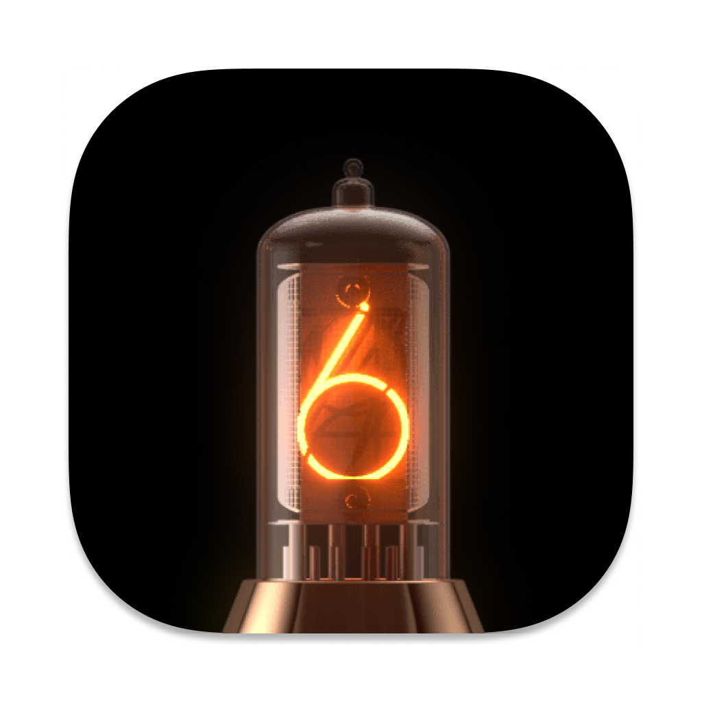

<p align="center">
  
</p>

# Clocteck RGB Tube Clock — MQTT Bridge for Home Assistant

A Node.js/TypeScript bridge that connects the **Clocteck RGB Tube Clock** (LED Nixie Simulation, firmware v3.101) to **Home Assistant** via MQTT.  
All controls are exposed automatically using [Home Assistant MQTT Discovery](https://www.home-assistant.io/docs/mqtt/discovery/) — zero manual YAML required.

---

## ✨ Features

- **🎨 Per-tube colour control** — 6 individual `light` entities with full HSV + brightness
- **💡 All-tubes master** — single `light` entity to set all 6 tubes at once
- **🕐 Display mode** — `select`: `Clock` / `Countdown` / `Cycle`
- **⚡ Cycle speed** — `select`: `Slow` / `Medium` / `Fast`
- **⏰ Alarm** — `number` entities for hour and minute
- **⏱ Countdown timer** — `number` entity (0–99 min, 0 = stop)
- **🌍 Timezone offset** — `number` entity (−12 to +14)
- **🌞 DST toggle** — `switch` entity
- **🕒 Sync Time** — `button` that pushes current server time to the clock
- **🔧 Firmware version** — diagnostic `sensor`
- Change detection — state is only re-published when something actually changed
- Graceful `offline` LWT when the bridge disconnects
- `services: mqtt:need` — auto-reads broker credentials from HA Supervisor (no manual MQTT config needed when running as addon)
- `docker compose` support for running outside of Home Assistant

---

## 📋 Entities

| Entity ID | Type | Description |
|---|---|---|
| `light.nixie_all_tubes` | `light` | Master colour + brightness for all 6 tubes simultaneously |
| `light.nixie_tube_1` … `light.nixie_tube_6` | `light` × 6 | Per-tube colour (HS) and brightness |
| `select.nixie_mode` | `select` | `Clock` / `Countdown` / `Cycle` |
| `select.nixie_speed` | `select` | `Slow` / `Medium` / `Fast` |
| `switch.nixie_dst` | `switch` | Daylight Saving Time on/off |
| `switch.nixie_time_format` | `switch` | 24h / 12h display |
| `number.nixie_alarm_hour` | `number` | Alarm hour (0–23) |
| `number.nixie_alarm_minute` | `number` | Alarm minute (0–59) |
| `number.nixie_timer` | `number` | Countdown timer (0–99 min) |
| `number.nixie_timezone` | `number` | Timezone offset (−12 to +14 h) |
| `button.nixie_sync_time` | `button` | Push current system time to the clock |
| `sensor.nixie_firmware` | `sensor` | Firmware version (diagnostic) |

---

## 🛠 Requirements

- Node.js **≥ 20** (tested on v22)
- Running MQTT broker (Mosquitto, EMQX, or the Home Assistant Mosquitto add-on)
- Clocteck RGB Tube Clock accessible on your local network at a **static IP**  
  (set a DHCP reservation in your router for the clock's MAC address)

---

## 🚀 Installation

### Option A — Home Assistant Add-on (recommended)

1. Copy the `app/` folder to your HA config directory:
   ```bash
   scp -r ./app/ root@homeassistant.local:/config/addons/nixie_clock/
   ```
2. In Home Assistant: **Settings → Add-ons → Add-on Store → ⋮ → Check for updates**  
   The addon appears under **Local add-ons**.
3. Click **Install**, then go to **Configuration** and set your clock's IP.
4. Click **Start** — all entities appear in HA automatically via MQTT Discovery.

> The addon uses `services: mqtt:need`, so if the **Mosquitto broker** add-on is installed,  
> broker credentials are read automatically — no manual MQTT config needed.

---

### Option B — Docker Compose

```bash
git clone https://github.com/resonaura/nixie-clock-mqtt.git
cd nixie-clock-mqtt/app

# Create your .env
cp .env.example .env
# Edit .env with your values

cd ..
docker compose up --build -d
```

Check logs:
```bash
docker compose logs -f nixie-clock-mqtt
```

---

### Option C — Run locally (dev)

```bash
git clone https://github.com/resonaura/nixie-clock-mqtt.git
cd nixie-clock-mqtt/app

npm install

cp .env.example .env
# Edit .env with your values

npm run dev        # tsx watch — auto-reloads on save
# or
npm run build && npm start
```

---

## ⚙️ Configuration

All settings are provided via `.env` (local/Docker) or the add-on **Configuration** tab (HA).

| Variable | Default | Description |
|---|---|---|
| `NIXIE_HOST` | `192.168.5.108` | IP address of the Clocteck clock |
| `POLL_INTERVAL` | `10` | How often to poll the clock for state changes (seconds) |
| `MQTT_URL` | `mqtt://localhost:1883` | MQTT broker URL |
| `MQTT_USER` | _(empty)_ | MQTT username |
| `MQTT_PASS` | _(empty)_ | MQTT password |
| `LOG_LEVEL` | `info` | `debug` / `info` / `warn` / `error` |

Example `.env`:
```env
NODE_ENV=production
NIXIE_HOST=192.168.5.108
POLL_INTERVAL=10
MQTT_URL=mqtt://192.168.1.100:1883
MQTT_USER=hauser
MQTT_PASS=hasecret
LOG_LEVEL=info
```

---

## 📡 How it works

1. On startup the bridge connects to the clock at `http://NIXIE_HOST` and fetches the firmware version.
2. It publishes MQTT Discovery configs for all entities — HA picks them up instantly.
3. The bridge polls `GET /config` every `POLL_INTERVAL` seconds and publishes state only when something changed.
4. When you change an entity in HA, the command arrives via MQTT → the bridge translates it to the appropriate HTTP GET call on the clock → re-polls after 500 ms to confirm the new state.

---

## 🤖 Example Automations

### Set all tubes to warm orange at sunset
```yaml
automation:
  alias: "Nixie — warm orange at sunset"
  trigger:
    platform: sun
    event: sunset
  action:
    service: light.turn_on
    target:
      entity_id: light.nixie_all_tubes
    data:
      hs_color: [30, 90]
      brightness: 200
```

### Set each tube to a different colour of the rainbow
```yaml
automation:
  alias: "Nixie — rainbow tubes"
  trigger:
    platform: homeassistant
    event: start
  action:
    - service: light.turn_on
      target: { entity_id: light.nixie_tube_1 }
      data: { hs_color: [0, 100],   brightness: 220 }
    - service: light.turn_on
      target: { entity_id: light.nixie_tube_2 }
      data: { hs_color: [45, 100],  brightness: 220 }
    - service: light.turn_on
      target: { entity_id: light.nixie_tube_3 }
      data: { hs_color: [90, 100],  brightness: 220 }
    - service: light.turn_on
      target: { entity_id: light.nixie_tube_4 }
      data: { hs_color: [180, 100], brightness: 220 }
    - service: light.turn_on
      target: { entity_id: light.nixie_tube_5 }
      data: { hs_color: [240, 100], brightness: 220 }
    - service: light.turn_on
      target: { entity_id: light.nixie_tube_6 }
      data: { hs_color: [300, 100], brightness: 220 }
```

### Set alarm to 07:30 every night
```yaml
automation:
  alias: "Nixie — set morning alarm"
  trigger:
    platform: time
    at: "23:00:00"
  action:
    - service: number.set_value
      target: { entity_id: number.nixie_alarm_hour }
      data: { value: 7 }
    - service: number.set_value
      target: { entity_id: number.nixie_alarm_minute }
      data: { value: 30 }
```

### Sync time every hour
```yaml
automation:
  alias: "Nixie — hourly time sync"
  trigger:
    platform: time_pattern
    hours: "/1"
  action:
    service: button.press
    target:
      entity_id: button.nixie_sync_time
```

### Switch to rainbow cycle mode at night
```yaml
automation:
  alias: "Nixie — night cycle mode"
  trigger:
    platform: time
    at: "22:00:00"
  action:
    - service: select.select_option
      target: { entity_id: select.nixie_mode }
      data: { option: Cycle }
    - service: select.select_option
      target: { entity_id: select.nixie_speed }
      data: { option: Medium }
```

---

## 🔌 Clock HTTP API Reference

The bridge translates MQTT commands to these HTTP calls on the clock:

| Endpoint | Params | Description |
|---|---|---|
| `GET /config` | — | Read full device state (polled periodically) |
| `GET /tubecolor` | `t=1-6` `h=0-360` `s=0-100` `v=0-100` | Set individual tube colour (HSV) |
| `GET /mode` | `m=1-3` `s=1-3` | Display mode + cycle speed |
| `GET /alarm` | `h=0-23` `m=0-59` | Set alarm time |
| `GET /timer` | `min=0-99` | Start countdown (0 = stop) |
| `GET /enDST` | `d=0\|1` | Disable/enable DST |
| `GET /time` | `t=<offset>` | Set timezone offset |
| `GET /uptm` | `t h m s y mo d` | Sync current time to the clock |
| `GET /version` | — | Firmware version number |

---

## 🐛 Troubleshooting

**Entities don't appear in HA after addon start:**
- Make sure the **MQTT integration** is configured in HA (`Settings → Devices & Services → MQTT`).
- Check the addon logs for `✅ Published N discovery entries` — if missing, MQTT connection failed.
- Verify broker credentials in the addon Configuration tab.

**Device shows as `unavailable`:**
- Ping `192.168.5.108` from your HA host.
- Set a static DHCP reservation for the clock in your router.
- Check the addon logs for `❌ Device unreachable`.

**Colours look slightly off:**
- The clock stores saturation internally as `0–254`; the bridge normalises it to the HA `0–100` range automatically.

**`time_format` switch does nothing:**
- Firmware v3.101 has no confirmed HTTP endpoint for toggling 12/24h externally (only via the built-in web UI). This will be updated when/if the endpoint is discovered.

---

## 📜 License

MIT — free to use, modify, and share.